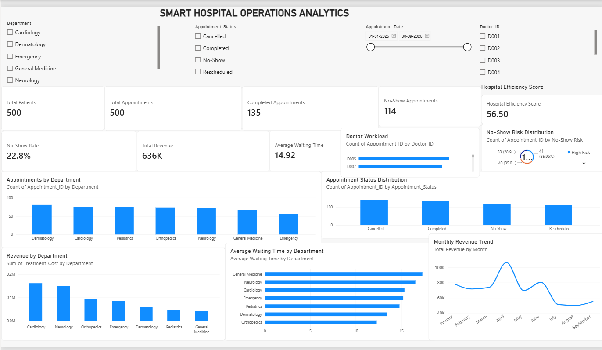

# Smart Hospital Operations Analytics

## Project Overview

Smart Hospital Operations Analytics is a data analytics project designed to analyze hospital patient appointments, department performance, waiting time, revenue, doctor workload, and appointment no-show patterns.

## Tools Used

- Python
- Pandas
- Matplotlib
- Power BI
- DAX
- CSV

## Dataset

The project uses three datasets:

- Patients
- Appointments
- Doctors

## Key Analysis

### Patient Analytics
- Total patients
- Patient demographics
- Department distribution

### Appointment Analytics
- Total appointments
- Completed appointments
- Cancelled appointments
- No-show appointments
- Rescheduled appointments

### Operational Analytics
- Average waiting time
- Waiting time by department
- Doctor workload
- Department appointment volume

### Financial Analytics
- Total treatment revenue
- Revenue by department
- Monthly revenue trends
- Revenue by doctor

### No-Show Analysis
- No-show rate
- No-show risk classification
- High, Medium and Low risk analysis

### Hospital Efficiency

A transparent Hospital Efficiency Score was created using:

- Appointment completion rate
- No-show rate
- Waiting time

## Power BI Dashboard

The dashboard provides interactive filters for:

- Department
- Appointment Status
- Doctor
- Appointment Date

It also contains KPI cards and interactive charts for hospital operations and performance analysis.

### Dashboard Preview



## Project Structure

```text
Smart-Hospital-Operations-Analytics
│
├── data
│   ├── patients.csv
│   ├── appointments.csv
│   └── doctors.csv
│
├── python
│   ├── generate_data.py
│   ├── analysis.py
│   └── visualization.py
│
├── visualizations
│
├── docs
│
├── powerbi
│   └── Smart-Hospital-Operations-Analytics.pbix
│
└── README.md
